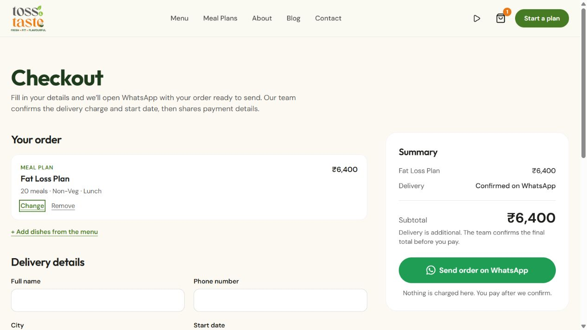
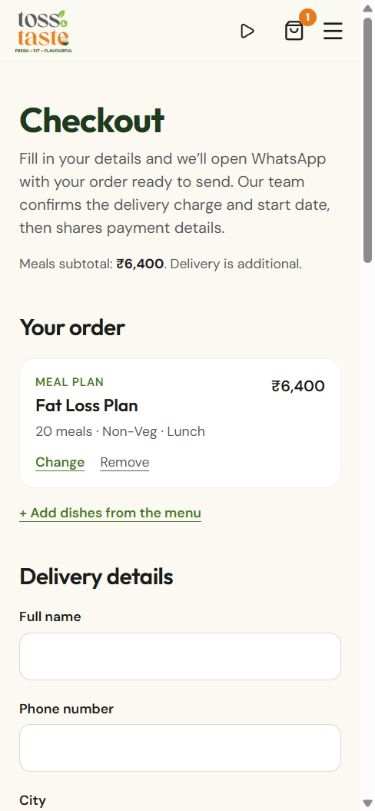

# Verified website fixes — 4 October 2026

Implemented in the newer `tossandtaste` project. The public website has not been deployed or edited.

## Completed

- Updated the Fat Loss matrix to the prices observed on its public product page during this session's audit; removed the unsupported ₹740 teaser.
- Tied the advertised lowest per-meal rate to the actual 30-meal vegetarian pack, with delivery explicitly additional.
- Repriced saved cart items and plans from the current catalog before display and WhatsApp composition. Removed items require a quote; stale browser prices are not retained.
- Replaced unknown ₹0+ totals with “Quote required” and labelled known checkout amounts as subtotals before delivery.
- Put mobile checkout fields before its submit action, with a compact subtotal at the top.
- Replaced incomplete custom radio controls with native radio inputs in the subscription builder and snack packs. Category filters now use pressed-button semantics instead of incomplete tab roles.
- Added Escape dismissal, focus movement, keyboard containment, background inert handling and breakpoint cleanup to mobile navigation. Same-route menu links also close the menu.
- Added a shared pause control for automatic videos. Video playback now also respects reduced-motion preferences, data-saving mode where exposed by the browser, visibility and offscreen state. Explicit smooth scrolling respects reduced motion.
- Removed blanket claims that every dish has nutrition figures and universal next-day delivery. Existing nutrition values, business identity and operating policies were not invented or replaced.
- Added sitemap.xml, robots.txt and route-specific canonicals for public pages/articles. Checkout retains noindex and is omitted from the sitemap.

## Validation

- ESLint: passed.
- TypeScript: passed.
- Production build: passed with network access for the existing Google Fonts. The restricted build initially failed to fetch those fonts.
- Regression checks: all 18 published plan combinations; stale saved plan/dish prices; pack pricing; unknown/removed items; nonmutation of saved data; sitemap and robots.
- Production HTTP checks: all 16 public routes respond successfully and have the expected canonical URL; sitemap.xml and robots.txt resolve; checkout has noindex.
- Browser: Fat Loss selection and checkout; arrow-key meal selection; arrow-key snack-pack selection (8 pieces correctly displays ₹360); category filter; mobile form ordering at 390px; menu initial focus, reverse-Tab wrap and Escape/focus restoration; global pause stops all 17 homepage videos.
- Reduced-motion/data-saving playback guards were inspected in source; changing the user's system/browser preferences was not part of the browser checks.
- No order or external message was sent, and no payment was attempted.

Run `node scripts/check-audit-fixes.mjs` for pricing checks. Supply the locally running site's URL to also check production routes: `node scripts/check-audit-fixes.mjs http://localhost:3011`.

## Still dependent on business information or integration

The audit's server order/payment queue, delivery eligibility/fees, subscription account and ledger, approved trial offers/weekly menus, campus/office workflows, exact business location/review listing, validated nutrition/allergens and analytics account remain outstanding. No placeholder integration is represented as operational.

## Screenshots

